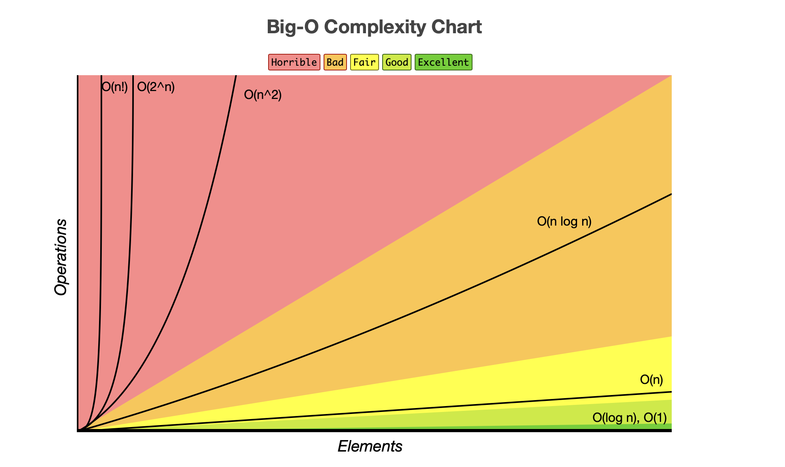
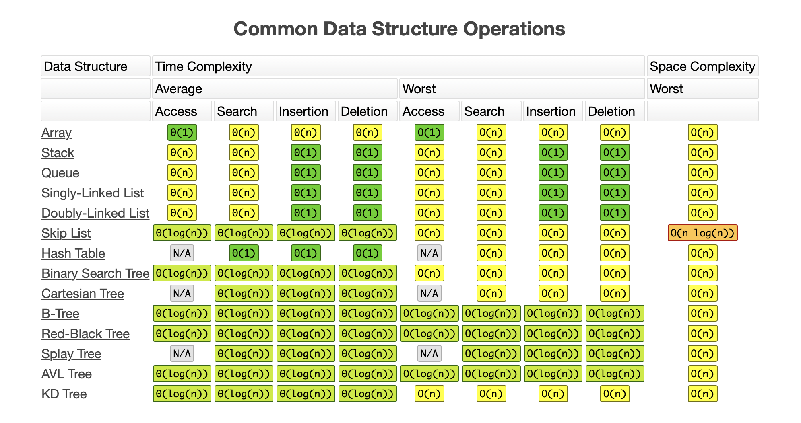
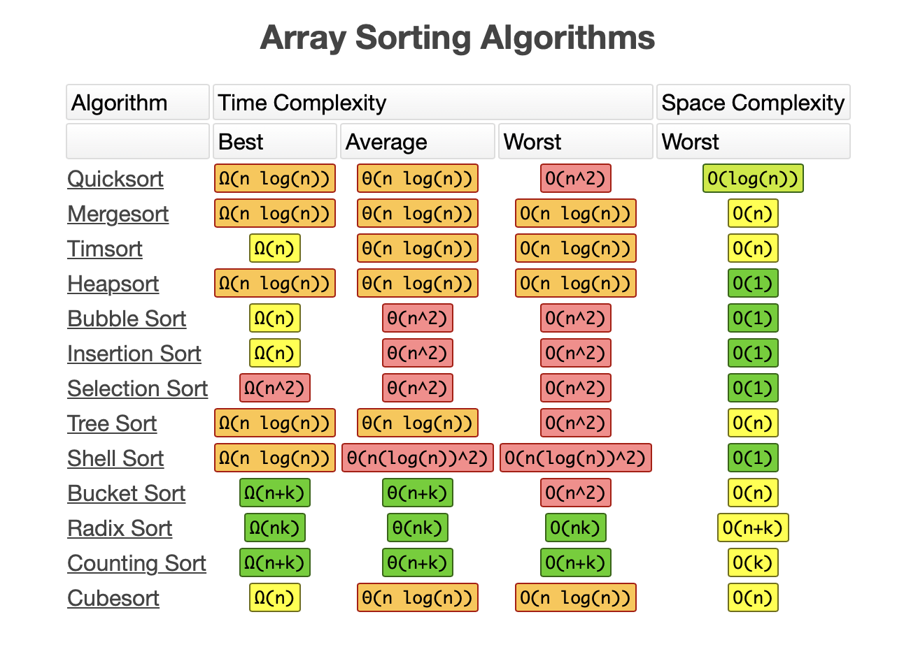
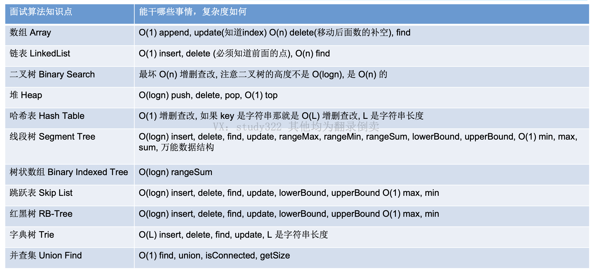
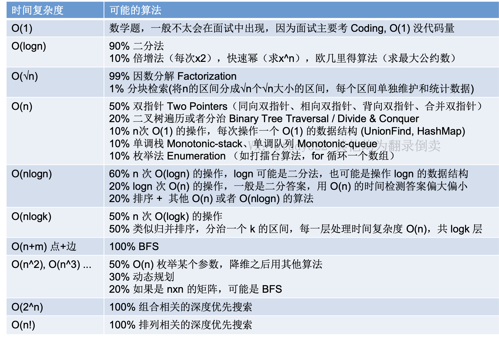
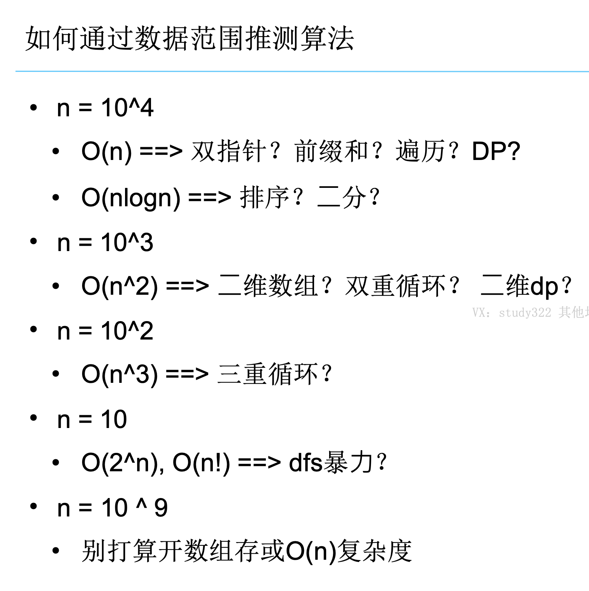
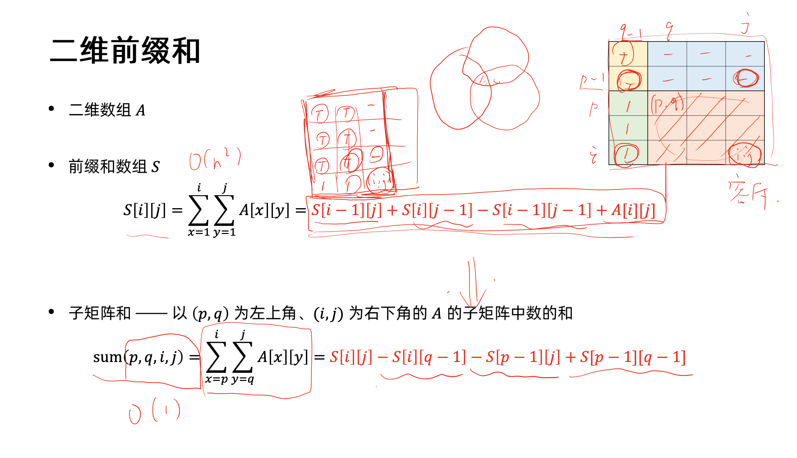
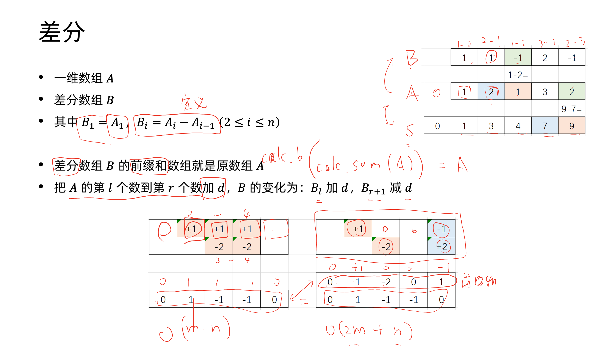

## Big O







## 数据结构复杂度



## 算法复杂度



## 数据范围



## 二分法

```python
def binarySearch(nums: List[int], target: int):
    left = 0
    right = len(nums) - 1

    while left + 1 < right:
        mid = (left + right) // 2

        if nums[mid] < target:
            left = mid
        elif nums[mid] == target:
            right = mid
        else:
            right = mid
    # left is first position
    if nums[left] == target:
        return left
    if nums[right] == target:
        return right

    return -1
```

## 二进制

`x & (x - 1 )` 将二进制最右边的1变成0，例如 1100 → 1000

`x & (- x)` 取最低位的1，例如 1100 → 100

`(x >> n) & 1` 取二进制下第n为的值

`x | (1 << n )` 将第二进制第n为置为1

`x & ～(1 << n )`将第二进制第n为置为0

## 双指针  
同向  

```python
	class Solution:
		def characterReplacement(self, s: str, k: int) -> int:
			if not s:
				return 0
	
			n = len(s)
			left = 0
			maxFreq = 0
			res = 0
			dct = {}
	
			for right in range(n):
				dct[s[right]] = dct.get(s[right], 0) + 1
				maxFreq = max(maxFreq, dct[s[right]])
	
				while left < right and right - left + 1 - maxFreq > k:
					dct[s[left]] -= 1
					left += 1
	
				res = max(res, right - left + 1)
	
			return res
```
    

## 树遍历

### 二叉树

* 中序遍历
	* 递归    

		```python  
		def inorderTraversal(self, root: Optional[TreeNode]) -> List[int]:
			res = []
			self.recursiveCore(root, res)
			return res
		
		def recursiveCore(self, root, res):
			if not root:
				return
			
			self.recursiveCore(root.left, res)
			res.append(root.val)
			self.recursiveCore(root.right, res)
		```
	* 非递归

		```python
		def inorderTraversal(self, root: Optional[TreeNode]) -> List[int]:
			if not root:
				return []
			res = []
			stack = []
			cur = root
		
			while stack or cur:
				while cur:
					stack.append(cur)
					cur = cur.left
				
				cur = stack.pop()
				res.append(cur.val)
				cur = cur.right
			
			return res
		```
* 迭代器  

	```python
	class InorderIterator:
	  def __init__(self, root):
		self.stack = []
		self.populate(root)
	
	  def populate(self, root):
		while root:
		  self.stack.append(root)
		  root = root.left
	  
	  def hasNext(self):
		return len(self.stack) != 0
	
	  def getNext(self):
		if not self.hasNext():
		  return None
		cur = self.stack.pop()
		self.populate(cur.right)
		return cur
	```
        
- 前序遍历
    - 递归

        ```python
        class Solution:
            def preorderTraversal(self, root: Optional[TreeNode]) -> List[int]:
                res = []
        
                self.recursiveCore(root, res)
                return res
            
            def recursiveCore(self, root, res):
                if not root:
                    return 
        
                res.append(root.val)
                self.recursiveCore(root.left, res)
                self.recursiveCore(root.right, res)
        ```
    - 非递归

		```python
		class Solution:
			def preorderTraversal(self, root: Optional[TreeNode]) -> List[int]:
				if not root:
					return []
				res = []
				stack = []
				cur = root
		
				while cur or stack:
					while cur:
						res.append(cur.val)
						stack.append(cur)
						cur = cur.left
					
					cur = stack.pop()
					cur = cur.right
				
				return res
		```
        
- 后序遍历
    - 递归

        ```python
        def postorderTraversal(self, root: Optional[TreeNode]) -> List[int]:
                res = []
                self.recursiveCore(root, res)
                return res
        
            def recursiveCore(self, root, res):
                if not root:
                    return
        
                self.recursiveCore(root.left, res)
                self.recursiveCore(root.right, res)
                res.append(root.val)
        ```
        
    - 非递归

		```python
        # 从栈中弹出的节点，我们只能确定其左子树肯定访问完了
        # 但是无法确定右子树是否访问过
        def postorderTraversal(self, root: Optional[TreeNode]) -> List[int]:
                if not root:
                    return []
                res = []
                stack = []
                cur = root
                pre = None
                
                while cur or stack:
                    while cur:
                        stack.append(cur)
                        cur = cur.left
        
                    cur = stack[-1]
        						# 有未遍历的右子树？
                    if cur.right and pre != cur.right:
                        cur = cur.right
        						# 统计遍历结果
                    else:
                        res.append(cur.val)
        								# 把peek的pop掉
                        stack.pop()
        								# pre记住
                        pre = cur 
        								# 因为遍历到最左边了，没有左子树
                        cur = None
                
                return res
		```
- 层次遍历

    ```python
    def levelOrder(self, root: 'TreeNode') -> List[List[int]]:
          if not root:
              return []
          queue = [root]
          res = []
    
          while queue:
              # 记录应该有几个和当前层的list
              levelCount = len(queue)
              levelList = []
              for _ in range(levelCount):
                  cur = queue.pop(0)
                  levelList.append(cur.val)
                  if cur.left:
                      queue.append(cur.left)
                  if cur.right:
                      queue.append(cur.right)
    
              res.append(levelList)
          
          return res
    ```
    

### N叉树

- 前序遍历
    - 递归

        ```python
        def preorder(self, root: 'Node') -> List[int]:
                res = []
                self.recursiveCore(root, res)
                return res
            
            def recursiveCore(self, root, res):
                if not root:
                    return
        
                res.append(root.val)
                for child in root.children:
                    self.recursiveCore(child, res)
        ```
    - 非递归

        ```python
        def preorder(self, root: 'Node') -> List[int]:
			if not root:
				return []
			stack = []
			res = []
			dct = {}
			cur = root
	
			while cur or stack:
				while cur:
					res.append(cur.val)
					stack.append(cur)
					if not cur.children:
						break
					children = cur.children
					cur = children.pop(0)
					dct[cur] = children
	
				cur = stack[-1]
				children = dct.get(cur, [])
				# 不同于二叉树，需要进入所有节点后才能pop
				if children:
					cur = children.pop(0)
				else:
					# 处理完所有节点再pop
					stack.pop()
					cur = None
			return res
        ```
        - 优化：每次将children倒序push入stack即可

            ```python
            def preorder1(self, root: 'Node') -> List[int]:
				if not root:
					return []
				stack = [root]
				res = []
		
				while stack:
					cur = stack.pop()
					res.append(cur.val)
					stack += cur.children[:: -1]
		
				return res
            ```
- 后序遍历
    - 递归

        ```python
        def postorder(self, root: 'Node') -> List[int]:
                res = []
                self.recursiveCore(root, res)
        
                return res
        
		def recursiveCore(self, root: 'Node', res):
			if not root:
				return
	
			for child in root.children:
				self.recursiveCore(child, res)
			res.append(root.val)
        ```
    - 非递归

        ```python
        def postorder(self, root: 'Node') -> List[int]:
			if not root:
				return []
			stack = []
			res = []
			dct = {}
			cur = root
	
			while cur or stack:
				while cur:
					stack.append(cur)
					if not cur.children:
						break
					children = cur.children
					dct[cur] = children
					cur = children.pop()
	
				cur = stack[-1]
				children = dct.get(cur, [])
				# 不同于二叉树，需要进入所有节点后才能pop
				if children:
					cur = children.pop(0)
				else:
					# 处理完所有节点再pop
					res.append(cur.val)
					stack.pop()
					cur = None
			return res
        ```  
- 层次遍历

    ```python
    # 进入while循环之前，queue内是该层的所有
    def levelOrder(self, root: 'Node') -> List[List[int]]:
		if not root:
			return None
		queue = [root]
		res = []

		while queue:
						# 记录应该有几个和当前层的list
			levelCount = len(queue)
			levelList = []
			for _ in range(levelCount):
				cur = queue.pop(0)
				levelList.append(cur.val)
				queue += cur.children
			res.append(levelList)
		
		return res
    ```
## 图
### 双向BFS
模块化

```python
class Solution:

    def getNeighbors(self, word, steps):
        word = list(word)
        n = len(word)
        neighbors = []
        for i in range(n):
            orgCh = word[i]
            for offset in range(26):
                newCh = chr(offset + ord('a'))
                if newCh == orgCh:
                    continue
                word[i] = newCh
                newWord = ''.join(word)
                if newWord in self.wordSet and newWord not in steps:
                    neighbors.append(newWord)
            word[i] = orgCh

        return neighbors

    def bfs(self, queue, steps, otherSteps):

        while queue:
            n = len(queue)
            for _ in range(n):
                curWord = queue.popleft()
                step = steps[curWord]
                for neighbor in self.getNeighbors(curWord, steps):
                    if neighbor in otherSteps:
                        return step + otherSteps[neighbor]
                    steps[neighbor] = step + 1
                    queue.append(neighbor)

        return 0

    def ladderLength(self, beginWord: str, endWord: str, wordList: List[str]):
        if endWord not in wordList:
            return 0

        self.wordSet = set(wordList)
        steps = {beginWord: 1}
        steps1 = {endWord: 1}

        queue = deque([beginWord])
        queue1 = deque([endWord])

        while queue or queue1:
            res = self.bfs(queue, steps, steps1)
            if res != 0:
                return res
            res = self.bfs(queue1, steps1, steps)
            if res != 0:
                return res

        return 0
```
### 有向图
### 拓扑排序
```python
def canFinish(self, numCourses: int,prerequisites: List[List[int]]) -> bool:
	inDegrees = [0] * numCourses
	# graph 表示学完i课程之后可以学哪些课程[]
	graph = defaultdict(list)
	res = []

	for p in prerequisites:
		# 休0需要1 则 1->0
		inDegrees[p[0]] += 1
		# graph 为出度表
		graph[p[1]].append(p[0])

	# 遍历获得入度为0的课程
	# 从这些课程出发
	queue = []
	for i in range(numCourses):
		if inDegrees[i] == 0:
			queue.append(i)

	while queue:
		cur = queue.pop(0)
		# 每学一个课程记录下
		res.append(cur)
		for post in graph[cur]:
			inDegrees[post] -= 1
			if inDegrees[post] == 0:
				queue.append(post)

	return len(res) == numCourses
```
### 广度优先
```python
from typing import List

class Solution:

    def numIslands(self, grid: List[List[str]]) -> int:
        m = len(grid)
        n = len(grid[0])
        visited = [[False] * n for _ in range(m)]
        res = 0
        for i in range(m):
            for j in range(n):
                if grid[i][j] == '1' and not visited[i][j]:
                    # 每次找到一个新入口，岛屿数量加一
                    res += 1
                    # 利用bfs把访问过的岛屿标记
                    self.bfs(visited, grid, [i, j])

        return res

    # 广度优先
    def bfs(self, visited, grid, source):
        m = len(grid)
        n = len(grid[0])
        dirs = [[0, 1], [0, -1], [1, 0], [-1, 0]]

        # 每次入队的时候标记访问
        queue = [source]
        visited[source[0]][source[1]] = True

        while queue:
            # 当前节点
            cur = queue.pop(0)
            for dir in dirs:
                next = [dir[0] + cur[0], dir[1] + cur[1]]
                if 0 <= next[0] < m and 0 <= next[1] < n and grid[next[0]][
                        next[1]] == '1' and not visited[next[0]][next[1]]:
                    queue.append(next)
                    visited[next[0]][next[1]] = True
```
### 深度优先
```python
def dfs(graph, source):
    visited = [False] * len(graph.graph)
    stack = [source]
    res = ''

    while stack:
        source = stack.pop()
        if not visited[source]:
            res += str(source)
        node = graph.graph[source]
        while node is not None:
            data = node.vertex
            if not visited[data]:
                stack.append(data)
            node = node.next

    return res
```
### SPFA
发现自己的path变小了，那重新放回队列

```python
class Solution:
    
    def buildGraph(self, times, n):
        graph = {i : [] for i in range(1, n + 1)}
        
        for src, dest, delay in times:
            graph[src].append((dest, delay))
        
        return graph
    
    
    def networkDelayTime(self, times: List[List[int]], n: int, k: int) -> int:
        MAX = 10 ** 9
    
        graph = self.buildGraph(times, n)
        dist = {i: MAX for i in range(1, n + 1)}
        dist[k] = 0
        queue = deque()
        queue.append((k, 0))
        inQueue = [False] * (n + 1)
        inQueue[k] = True
        
        while queue:
            src, curDelay = queue.popleft()
            inQueue[src] = False
            
            for dest, delay in graph[src]:
                nextDelay = curDelay + delay
                
                if nextDelay >= dist[dest]:
                    continue
                
                dist[dest] = nextDelay
                
                if not inQueue[dest]:
                    queue.append((dest, nextDelay))
                    inQueue[dest] = True
        
        res = max(dist.values())
        
        return res if res != MAX else -1
```
### Dijsktra
单源最短路径问题，贪心思想  
利用小根堆，每次更新最短边

```python
class Solution:

    def buildGraph(self, times: List[List[int]], n: int):
        graph = {i: [] for i in range(1, n + 1)}

        for time in times:
            src = time[0]
            dest = time[1]
            delay = time[2]
            graph[src].append((dest, delay))

        return graph

    def networkDelayTime(self, times: List[List[int]], n: int, k: int) -> int:
        graph = self.buildGraph(times, n)
        dist = {i: 10**9 for i in range(1, n + 1)}
        dist[k] = 0
        minHeap = [(0, k)]

        while minHeap:
            curDelay, cur = heappop(minHeap)
            for neighbor, delay in graph[cur]:
                nextDelay = curDelay + delay
                if nextDelay >= dist[neighbor]:
                    continue
                # if it nextDelay is shorter
                # update it and add it for further update
                dist[neighbor] = nextDelay
                heappush(minHeap, (nextDelay, neighbor))

        res = max(dist.values())
        return res if res != 10**9 else -1
```
### Floyd
O(n3)求出所有点之间点最短距离，基于动态规划  
`dist[i][j] = min(dist[i][j], dist[i][k] + dist[k][j])`  
意为：从i 到 j 之间点的标号不超过k的最小路径  

```python
class Solution:

    def findTheCity(self, n: int, edges: List[List[int]], distanceThreshold: int) -> int:
        MAX = (2 << 31) - 1
        dist = [[MAX] * n for _ in range(n)]
        for i in range(n):
            dist[i][i] = 0

        for edge in edges:
            x = edge[0]
            y = edge[1]
            z = edge[2]
            dist[x][y] = z
            dist[y][x] = z

        # Floyd
        # dist[i][j] = min(dist[i][j], dist[i][k] + dist[k][j])
        # k is label, i, j are vertice
        # through [i, j], label not bigger than k's shortest path
        for k in range(n):
            for i in range(n):
                for j in range(n):
                    dist[i][j] = min(dist[i][j], dist[i][k] + dist[k][j])

        res = 0
        resCount = n

        for i in range(n):
            count = 0
            for j in range(n):
                if dist[i][j] <= distanceThreshold:
                    count += 1
            if count <= resCount:
                res = i
                resCount = count

        return res
```
### Kruskal
总是选最小边，利用`DisjointSet` 来判断两点是否连通  

```python
class DisjointSet:

    def __init__(self, size) -> None:
        self.root = [i for i in range(size)]

    def find(self, x):
        if self.root[x] != x:
            self.root[x] = self.find(self.root[x])
        return self.root[x]

    def union(self, x, y):
        rootX = self.find(x)
        rootY = self.find(y)
        if rootX != rootY:
            self.root[rootY] = rootX
            return True
        return False

class Solution:

    def minCostConnectPoints(self, points: List[List[int]]) -> int:
        n = len(points)
        edges = []

        for i in range(1, n):
            for j in range(i):
                z = abs(points[i][0] - points[j][0]) + abs(points[i][1] - points[j][1])
                edges.append((i, j, z))
        
        edges.sort(key=lambda x: x[2])
        
        disjointSet = DisjointSet(n)
        res = 0
        for edge in edges:
            x = edge[0]
            y = edge[1]
            z = edge[2]
            if disjointSet.union(x, y):
                res += z
        
        return res
```
## 排序
### $O(n^2)$
- Selection Sort  
    Not Stable  
    选择最小的放到应该在的位置  
    
    ```python
    def selectionSort(nums):
        n = len(nums)
    
        # i指向已经排好序的最后一个
        for i in range(n):
            minIndex = i
            # 通过对比，找到未排序数组中最小的下标
            for j in range(i+1, n):
                minIndex = j if nums[minIndex] > nums[j] else minIndex
            # 交换数字
            nums[minIndex], nums[i] = nums[i], nums[minIndex]
    
        return nums
    ```
- Bubble Sort  
    Stable  
    泡泡把最大的带走  
    
    ```python
    def bubbleSort(nums):
        n = len(nums)
    
        for i in range(n):
            # 最后一个元素已归位
            for j in range(n-1-i):
                # 将大的和向后面的交换
                # 比下一个元素大则与它交换
                if nums[j] > nums[j+1]:
                    nums[j], nums[j+1] = nums[j+1], nums[j]
    
        return nums
    
    # 倒着来的
    def bubbleSort1(nums):
        n = len(nums)
    
        for i in range(n-1, -1, -1):
            for j in range(n-1, n-1-i, -1):
                if nums[j-1] > nums[j]:
                    nums[j], nums[j-1] = nums[j-1], nums[j]
    
        return nums
    ```
- Insertion Sort  
    Stable  
    后移数据，插入数据  
    
    ```python
    def insertionSort(nums):
        n = len(nums)
    
        for i in range(n):
            # 被判断的数
            num = nums[i]
            # 表示前一个下标
            j = i-1
            # 往前比较，一直找到比标记位小的位置
            while j >= 0 and num < nums[j]:
                nums[j+1] = nums[j]
                j -= 1
            # 应该插入第一个比他小的后面
            nums[j+1] = num
    
        return nums
    ```
- $O(nlogn)$
    - Merge Sort  
        Stable  
        递归  
        
        ```python
        from typing import List
        
        def mergeTwo(nums: List[int], left, mid, right):
            tmp = []
            l = left
            r = mid + 1
        
            while l <= mid and r <= right:
                if nums[l] <= nums[r]:
                    tmp.append(nums[l])
                    l += 1
                else:
                    tmp.append(nums[r])
                    r += 1
        
            while l <= mid:
                tmp.append(nums[l])
                l += 1
        
            while r <= right:
                tmp.append(nums[r])
                r += 1
        
            nums[left:right + 1] = tmp[:]
        
        def mergeSortCore(nums: List[int], left, right):
            if left >= right:
                return
        
            mid = (left + right) >> 1
            mergeSortCore(nums, left, mid)
            mergeSortCore(nums, mid + 1, right)
            mergeTwo(nums, left, mid, right)
        
        def mergeSort(nums: List[int]):
            if not nums:
                return
            n = len(nums)
            mergeSortCore(nums, 0, n - 1)
        
        nums = [1, 3, 2, 3, 1, 1]
        mergeSort(nums)
        print(nums)
        ```
    - Quick Sort  
        Not Stable  
        
        ```python
        # 选择pivot点
        def getPivotIndex(left, right):
            return randint(left, right)
        
        # 单循环
        def partition(nums, left, right):
            index = getPivotIndex(left, right)
            pivot = nums[index]
            # 将pivot 放到最后去
            nums[index], nums[right] = nums[right], nums[index]
            # i用来表示比pivot小的下标
            i = left
        
            # 遍历，将比pivot小的与i位置的进行交换
            for j in range(left, right):
                if nums[j] <= pivot:
                    nums[i], nums[j] = nums[j], nums[i]
                    i += 1
            # 最后将pivot放回去
            # 最终i就是pivot应该在的地方
            nums[i], nums[right] = nums[right], nums[i]
        
            return i
        
        def partition1(nums, left, right):
            pivotVal = nums[left]
            i, j = left, right
            while i < j:
                # 必须先从最右边找到一个比它小的
                while i < j and nums[j] >= pivotVal:
                    j -= 1
                # 找比他大的
                while i < j and nums[i] <= pivotVal:
                    i += 1
                # 交换
                nums[i], nums[j] = nums[j], nums[i]
            # 归位
            nums[i], nums[left] = nums[left], nums[i]
            return i
        
        def quickSort(nums, left, right):
            if left >= right:
                return
        
            pivotIndex = partition(nums, left, right)
            quickSort(nums, left, pivotIndex-1)
            quickSort(nums, pivotIndex+1, right)
        ```
## 动态规划
- 背包
    - 0/1 背包问题
        **必须先遍历物品再遍历背包**  
        倒序遍历是为了防止重复放入  
        
        ```python
        for i in range(1, n+1):
        	for j in range(bagWeight, weight[i]-1, -1):
        		dp[j] = max(dp[j], dp[j - weight[i]] + value[i)
        ```
        - 变种
            - 分成两组，两组的差距最小
                - `(sum - x)` 与 `x` 的最小值
                - 即求背包问题塞 `(sum - x - x)`
                - 塞`(sum - x - x)` 即意味着两者差距最小
            - 挑出若干数之和 ≥ X 且和最小
                - 即背包问题塞`(sum - x)`
                - 塞`(sum - x)` ，意味着反过来会使满`X` 的和最小
            - 石头碰撞问题
                - 和最小划分一样
    - 多重背包

        ```python
        for i in range(1, n+1):
        	for j in range(bagWeight, weight[i]-1, -1):
        		for count in range(min(capacity[i], j // weight[i]) + 1)
        			dp[j] = max(dp[j], dp[j - count * weight[i]] + count * value[i)
        ```
    - 完全背包
        排列 > 组合  
        **组合不强调元素之间的顺序，排列强调元素之间的顺序**  
        完全背包相对于0/1就是多了重复放入  
        那么就正着遍历  
        如果求**组合数**就是外层for循环遍历物品，内层for遍历背包  
        **理解为每个物品都遍历一次容量，元素间没有顺序**  
        比如`[1,5]` 两个元素，先把1加入计算再把5加入计算，只会出现`[1,5]` 的情况  
        不会出现`[5, 1]`的情况，即为组合  
        
        ```python
        for (int i = 0; i < coins.size(); i++) { // 遍历物品
            for (int j = coins[i]; j <= amount; j++) { // 遍历背包容量
                dp[j] += dp[j - coins[i]];
            }
        }
        ```
        如果求**排列数**就是外层for遍历背包，内层for循环遍历物品  
        **理解为每个容量都遍历一遍物品，元素间有顺序**  
        与组合相反，对于每个容量，都会计算`[1, 5][5, 1]`  
        
        ```python
        for (int j = 0; j <= amount; j++) { // 遍历背包容量
            for (int i = 0; i < coins.size(); i++) { // 遍历物品
                if (j - coins[i] >= 0) dp[j] += dp[j - coins[i]];
            }
        }
        ```
- 坐标型  
    一维坐标  
    - 子序列  
    二维坐标
- 前缀型  
    一个字符串划分——划分  
    两个字符串匹配——匹配  
- 区间型

    ```python
    class Solution:
    
        def PredictTheWinner(self, nums: List[int]) -> bool:
            n = len(nums)
            # opt[i][j] means maximum score a ahead of j
            opt = [[0] * n for _ in range(n)]
            # last stone, a get ahead of b for nums[i] score
            for i in range(n):
                opt[i][i] = nums[i]
    
            for length in range(2, n + 1):
                # i is the start point
                for i in range(n - length + 1):
                    # j is the end point
                    j = i + length - 1
                    # opt[i + 1][j] is the diff of player b
                    opt[i][j] = max(nums[i] - opt[i + 1][j], nums[j] - opt[i][j - 1])
    
            return opt[0][-1] >= 0
    ```
## 回溯
**排列问题时间复杂度为$O(n!)$**  
**组合问题时间复杂度为$O(2^n)$**  
**有的排列问题可以转换为组合问题，状态压缩**  
全排列问题，有重复元素  
全排列问题不使用startIndex，因为它需要所有元素  

```python
class Solution:
    def permuteUniqueCore(self, nums, visited, path, res):
        n = len(nums)
        
        if len(path) == n:
            res.append(list(path))
        
        for i in range(n):
            if visited[i]:
                continue

            if i > 0 and nums[i] == nums[i-1] and not visited[i-1]:
                continue
                
            path.append(nums[i])
            visited[i] = 1
            self.permuteUniqueCore(nums, visited, path, res)
            path.pop()
            visited[i] = 0
        
    
    def permuteUnique(self, nums: List[int]) -> List[List[int]]:
        res = []
        visited = [0] * len(nums)
        nums.sort()
        
        self.permuteUniqueCore(nums, visited, [], res)
        
        return res
```
回溯去重问题
选代表，`[1, 2(1), 2(2)]`  
如果2(1) 没选，再往后选则会出现重复  
即不可以跳过选择第一个2  
保证a(2) 在a(1) 后即可  
## 前缀和
### 一维
- 确定键值类型

```python
def subarraySum(self, nums: List[int], k: int) -> int:
	  # 前缀和 和 其个数
	  dct = {0: 1}
	  res = 0
	  total = 0
	
	  for num in nums:
	      total += num
	      res += dct.get(total-k, 0)
	      dct[total] = dct.get(total, 0)+1
	  
	  return res
```
### 二维


```python
class NumMatrix:

    def __init__(self, matrix: List[List[int]]):
        m = len(matrix)
        n = len(matrix[0])
        self.sums = [[0] * n for _ in range(m)]

        for i in range(m):
            for j in range(n):
                self.sums[i][j] = self.getSums(i - 1, j) + self.getSums(i, j - 1) - self.getSums(i - 1, j - 1) + matrix[i][j]

    def getSums(self, row, col):
        if row >= 0 and col >= 0:
            return self.sums[row][col]
        return 0

    def sumRegion(self, row1: int, col1: int, row2: int, col2: int) -> int:
        return self.getSums(row2, col2) - self.getSums(row2, col1 - 1) - self.getSums(row1 - 1, col2) + self.getSums(row1 - 1, col1 - 1)
```


```python
class Solution:
    # diffrence array

    def corpFlightBookings(self, bookings: List[List[int]], n: int) -> List[int]:
        res = [0] * n
        # if [left, right] + num
        # to diffrence array
        # boundry diffrence will be (left +num, right+1 -num)

        for left, right, num in bookings:
            res[left - 1] += num
            if right < n:
                res[right] -= num

        # sums up it's the original array
        for i in range(1, n):
            res[i] += res[i - 1]

        return res
```
## 单调栈
求 左/右 比当前值 小/大 的数，并且离当前下标最近  
最常见:找到 左/右 第一个比它 小/大 的元素  
**需要一个存在单调性的数据结构**  
单调增：栈顶的左右都比它要小，理解为当前较大的不生效  
- 换言之，左边到右边之间都是比中间大的  
单调减：栈顶的左右都比它要大，理解为当前较小的不生效  
- 换言之，左边到右边之间都是比中间小的  

```python
def trap(self, height: List[int]) -> int:
      n = len(height)
      ascStack = [0]
      res = 0

      for i in range(1, n):
          # pop出所有比它小的元素
          while ascStack and height[ascStack[-1]] < height[i]:
              mid = ascStack.pop()
              if ascStack:
                  rightHeight = height[i]
                  leftHeight = height[ascStack[-1]]
                  # 选两侧较小的高度
                  h = min(leftHeight, rightHeight) - height[mid]
                  w = i - ascStack[-1] - 1
                  res += h * w
          ascStack.append(i)

      return res
```
找最远比现在小或者大的点  
预处理成单调递增或减再倒序更新  

```python
class Solution:
    # monoStack none
    def maxWidthRamp(self, nums: List[int]) -> int:
        n = len(nums)
        stack = []

        # descending stack
        for i in range(n):
            if not stack or nums[stack[-1]] >= nums[i]:
                stack.append(i)

        res = 0
        index = n - 1
        # try every num from last
        while index >= 0:
            while stack and nums[stack[-1]] <= nums[index]:
                # if index - 1, the width will reduce
                res = max(res, index - stack.pop())

            index -= 1

        return res
```
## 字符串
### Rabin-Karp Hash
类似前缀和

```python
class Solution:

    def strStr(self, haystack: str, needle: str) -> int:
        if not haystack or not needle:
            return -1

        BASE = 131
        BUCKET = 1e9 + 7

        n = len(needle)
        needleHash = 0
        power = 1
        for i in range(n):
            digit = ord(needle[i])
            power *= BASE
            needleHash = (needleHash * BASE + digit) % BUCKET

        m = len(haystack)
        prefixHash = [0] * (m + 1)
        left = 0
        for right in range(m):
            digit = ord(haystack[right])
            prefixHash[right + 1] = (prefixHash[right] * BASE + digit)

            if right - left + 1 >= n:
                curHash = (prefixHash[right + 1] - prefixHash[left] * power + BUCKET) % BUCKET
                if curHash == needleHash and needle == haystack[left:right + 1]:
                    return left
                left += 1

        return -1
```
### KMP
```python
class Solution:

    def getNext(self, needle: str):
        n = len(needle)
        next = [0] * n
        j = 0

        for i in range(1, n):
            while j > 0 and needle[i] != needle[j]:
                j = next[j - 1]
            if needle[i] == needle[j]:
                j += 1
            next[i] = j

        return next

    def strStr(self, haystack: str, needle: str) -> int:
        next = self.getNext(needle)
        j = 0

        for i in range(len(haystack)):
            while j > 0 and haystack[i] != needle[j]:
                j = next[j - 1]
            if haystack[i] == needle[j]:
                j += 1
						# 出现了模式串
            if j == len(needle):
                return i - len(needle) + 1

        return -1 
```
## 单调队列
滑动窗口的最大/小值 = 单调队列  
单调栈需要删除栈底 = 单调队列  

```python
class AscQueue:

    def __init__(self):
        self.queue = []

    def push(self, value):
        # 与队尾比较，把比它小的全部弹出去
        # 保持队列单调递增
        while self.queue and value > self.queue[-1]:
            self.queue.pop()
        self.queue.append(value)

    def pop(self, value):
        if self.queue[0] == value:
            self.queue.pop(0)

    def get(self):
        return self.queue[0]

class Solution:

    def maxSlidingWindow(self, nums: List[int], k: int) -> List[int]:
        n = len(nums)
        ascQueue = AscQueue()
        res = []
        left = 0

        for right, num in enumerate(nums):
            ascQueue.push(num)
            if right - left + 1 >= k:
                res.append(ascQueue.get())
                value = nums[left]
                ascQueue.pop(value)
                left += 1

        return res
```
## 设计数据结构
### Heap
```python
class MyHeap:
    def __init__(self, desc=False) -> None:
        self.data = []
        self.desc = desc

    @property
    def size(self):
        return len(self.data)

    def swap(self, index1, index2):
        self.data[index1], self.data[index2] = self.data[index2], self.data[index1]

    # 用于判断前者是否比后者小
    def camparator(self, nums1, nums2):
        return nums1 > nums2 if self.desc else nums1 < nums2

    # 弹出
    # 1. 获取该元素
    # 2. 与最后一个交换
    # 3. 弹出该元素
    # 4. 将第一个元素下沉
    def pop(self):
        item = self.data[0]
        self.swap(0, self.size-1)
        self.data.pop()
        self.siftDown(0)
        return item

    # 1. 追加到最后
    # 2. 将该元素上浮
    def push(self, val):
        self.data.append(val)
        self.siftUp(self.size-1)

    def siftDown(self, index):
        # 与其children对比
        # 比他们大就下沉
        while index*2+1 < self.size:
            leftChildIndex = index*2 + 1
            rightChildIndex = index*2 + 2
            smallest = index

            # 记录左右哪个更加小
            if self.camparator(self.data[leftChildIndex], self.data[smallest]):
                smallest = leftChildIndex

            if rightChildIndex < self.size and self.camparator(self.data[rightChildIndex], self.data[smallest]):
                smallest = rightChildIndex

            if smallest == index:
                break

            self.swap(smallest, index)
            index = smallest

    def siftUp(self, index):
        # 与其parent对比
        # 若比parent小则上升
        while index:
            parendIndex = (index-1) // 2

            if self.camparator(self.data[index], self.data[parendIndex]):
                self.swap(index, parendIndex)
                index = parendIndex
            else:
                break
```
### LRU
添加只会发生在队头——addToHead  
删除会发生任意处——deleteNode  
* 满容量时添加新节点  
1. 添加到队头——addToHead
2. 删除队尾deleteTail——调用deleteNode  
* 节点存在
1. 先删除改节点
2. 移动到队头

```python
class Node:
    def __init__(self, key=0, value=0) -> None:
        self.key = key
        self.value = value
        self.pre = Any
        self.next = Any

class LRUCache:

    def __init__(self, capacity: int):
        self.cache = {}
        self.capacity = capacity
        self.size = 0
        self.head = Node()
        self.tail = Node()
        self.head.next = self.tail
        self.tail.pre = self.head

    def deleteNode(self, node: Node):
        node.pre.next = node.next
        node.next.pre = node.pre

    def moveToHead(self, node: Node):
        self.deleteNode(node)
        self.addToHead(node)

    def deleteTail(self):
        node = self.tail.pre
        self.deleteNode(node)
        return node

    def addToHead(self, node):
        node.pre = self.head
        node.next = self.head.next
        self.head.next.pre = node
        self.head.next = node

    def get(self, key: int) -> int:
        if key not in self.cache:
            return -1
        node = self.cache[key]
        self.moveToHead(node)
        return node.value

    def put(self, key: int, value: int) -> None:
        if key not in self.cache:
            node = Node(key, value)
            self.cache[key] = node
            self.addToHead(node)
            self.size += 1
            if self.size > self.capacity:
                delNode = self.deleteTail()
                self.cache.pop(delNode.key)
                self.size -= 1
        else:
            node = self.cache[key]
            node.value = value
            self.moveToHead(node)
```
### LinkedList
```python
class MyLinkedListNode:
    def __init__(self, val=0, next=Any) -> None:
        self.val = val
        self.next = next

class MyLinkedList:

    def __init__(self):
        self.dummyHead = MyLinkedListNode()
        self.size = 0

    def get(self, index: int) -> int:
        if not 0 <= index < self.size:
            return -1

        cur = self.dummyHead
        for _ in range(index+1):
            cur = cur.next
        return cur.val

    def addAtHead(self, val: int) -> None:
        self.addAtIndex(0, val)

    def addAtTail(self, val: int) -> None:
        self.addAtIndex(self.size, val)

    def addAtIndex(self, index: int, val: int) -> None:
        n = index
        if n < 0:
            n = 0
        if n > self.size:
            return

        cur = self.dummyHead
        for _ in range(n):
            cur = cur.next
        post = cur.next
        node = MyLinkedListNode(val)
        cur.next = node
        node.next = post
        self.size += 1

    def deleteAtIndex(self, index: int) -> None:
        if not 0 <= index < self.size:
            return

        cur = self.dummyHead
        for _ in range(index):
            cur = cur.next
        cur.next = cur.next.next
        self.size -= 1
```
### Stack
```python
class MyStack:
    def __init__(self):
        self.stackList = []
        self.stackSize = 0

    def isEmpty(self):
        return self.stackSize == 0

    def peek(self):
        if self.isEmpty():
            return None
        return self.stackList[-1]

    def getSize(self):
        return self.stackSize

    def push(self, data):
        self.stackSize += 1
        self.stackList.append(data)

    def pop(self):
        if self.isEmpty():
            return None
        self.stackSize -= 1
        return self.stackList.pop()
```
### Queue
```python
class Node:
    def __init__(self, val, next=None, pre=None) -> None:
        self.val = val
        self.next = next
        self.pre = pre

class DoublyLinkedList:
    def __init__(self) -> None:
        self.head = None
        self.tail = None
        self.size = 0

    def getHead(self):
        return self.head.val

    def isEmpty(self):
        return self.head == None

    def insertTail(self, val):
        self.size += 1
        node = Node(val)
        if self.isEmpty():
            self.head = node
            self.tail = node
        else:
            self.tail.next = node
            node.pre = self.tail
            self.tail = node

        return node.val

    def removeHead(self):
        if self.isEmpty:
            return False
        node = self.head
        self.size -= 1
        if self.siz == 1:
            self.head = None
            self.tail = None
        else:
            self.head = node.next
            self.head.pre = None
            node.next = None
        return node.val

    def getTail(self):
        return self.tail.val if self.head else None

    def __str__(self) -> str:
        if self.isEmpty():
            return ''
        node = self.head
        res = "[" + str(node.val) + ","
        node = node.next

        while node.next:
            res += str(node.val) + ','
            node = node.next
        res += str(node.val) + ']'
        return res

class MyQueue:
    def __init__(self):
        self.data = DoublyLinkedList()

    def isEmpty(self):
        return self.data.size == 0

    def getFront(self):
        if self.isEmpty():
            return None
        return self.data.getHead()

    def getRear(self):
        if self.isEmpty():
            return None
        return self.data.getTail()

    def getSize(self):
        return self.data.size

    def enqueue(self, val):
        return self.data.insertTail(val)

    def dequeue(self):
        return self.data.getHead()

    def printList(self):
        return self.data.__str__()
```
### Trie
```python
class TrieNode:
    def __init__(self) -> None:
        self.children = {}
        self.isWord = False

class Trie:
    def __init__(self):
        self.root = TrieNode()

    def insert(self, word: str) -> None:
        node = self.root
        for ch in word:
            if ch not in node.children:
                node.children[ch] = TrieNode()
            node = node.children[ch]
        node.isWord = True

    def search(self, word: str) -> bool:
        node = self.root
        for ch in word:
            if ch not in node.children:
                return False
            node = node.children[ch]
        return node.isWord

    def startsWith(self, prefix: str) -> bool:
        node = self.root
        for ch in prefix:
            if ch not in node.children:
                return False
            node = node.children[ch]
        return True
```
### DisjointSet
- 数据类型通用  
    利用父指针
    
    ```python
    class DisjointSet:
    
        def __init__(self) -> None:
            self.root = {}
            self.sizeOfRoot = {}
            self.sizeOfSet = 0
    
        def add(self, x):
            if x in self.root:
                return False
    
            self.root[x] = x
            self.sizeOfSet += 1
            self.sizeOfRoot[x] = 1
            return True
    
        def find(self, x):
            if x != self.root[x]:
                self.root[x] = self.find(self.root[x])
            return self.root[x]
    
        def union(self, x, y):
            rootX = self.find(x)
            rootY = self.find(y)
            if rootX != rootY:
                self.root[rootY] = rootX
                self.sizeOfSet -= 1
                self.sizeOfRoot[rootX] += self.sizeOfRoot[rootY]
    
        def isConnected(self, x, y):
            return self.find(x) == self.find(y)
    
        def getSizeOfSet(self):
            return self.sizeOfSet
    
        def getSizeOfRoot(self, x):
            return self.sizeOfRoot[x]
    
        def getAllSizes(self):
            return self.sizeOfRoot
    ```
- 数组型

    ```python
    class UnionFind:
        def __init__(self, size) -> None:
            self.root = [i for i in range(size)]
    
        def find(self, x):
            if x == self.root[x]:
                return x
            # 递归返回会更新节点
            self.root[x] = self.find(self.root[x])
            return self.root[x]
    
        def union(self, x, y):
            rootX = self.find(x)
            rootY = self.find(y)
            if rootX != rootY:
                self.root[rootY] = rootX
    
        def connected(self, x, y):
            return self.find(x) == self.find(y)
    ```  
- 压缩路径+按秩合并

    ```python
    class UnionFind:
        def __init__(self, size) -> None:
            self.root = [i for i in range(size)]
            self.rank = [1] * size
    
    		def find(self, x):
            # 递归返回会更新节点
            if self.root[x] != x:
                self.root[x] = self.find(self.root[x])
            return self.root[x]
    
        def union(self, x, y):
            rootX = self.find(x)
            rootY = self.find(y)
            if rootX != rootY:
                if self.rank[rootX] > self.rank[rootY]:
                    self.root[rootY] = rootX
                elif self.rank[rootY] < self.rank[rootX]:
                    self.root[rootX] = rootY
                else:
                    self.root[rootY] = rootX
                    self.rank[rootX] += 1
    
        def connected(self, x, y):
            return self.find(x) == self.find(y)
    ```
### HashTable
```python
# 变长拉链法
class MyHashMap:

    def __init__(self):
        self.buckets = 1009
        self.table = [[] for _ in range(self.buckets)]

    def hash(self, key):
        return key % self.buckets

    def put(self, key: int, value: int) -> None:
        hashKey = self.hash(key)
        for entry in self.table[hashKey]:
            if entry[0] == key:
                entry[1] = value
                return
        self.table[hashKey].append([key, value])

    def get(self, key: int) -> int:
        hashKey = self.hash(key)
        for entry in self.table[hashKey]:
            if entry[0] == key:
                return entry[1]
        return -1

    def remove(self, key: int) -> None:
        hashKey = self.hash(key)
        for i, entry in enumerate(self.table[hashKey]):
            if entry[0] == key:
                self.table[hashKey].pop(i)
                return
```
### HashSet
```python
class MyHashSet:

    def __init__(self):
        self.hash = 1009
        self.data = [[] for _ in range(self.hash)]

    def getId(self, key):
        return key % self.hash

    def add(self, key: int) -> None:
        id = self.getId(key)
        if self.contains(key):
            return
        self.data[id].append(key)

    def remove(self, key: int) -> None:
        id = self.getId(key)
        if not self.contains(key):
            return
        self.data[id].remove(key)

    def contains(self, key: int) -> bool:
        id = self.getId(key)
        return key in self.data[id]
```
### SegmentTree
```python
class SegmentTree:

    def __init__(self, nums: List[int]) -> None:
        self.nums = nums
        self.size = len(nums)
        # n leaf nodes has no more than 4*n total nodes
        self.tree = [0] * (self.size * 4)
        self.build(0, 0, self.size - 1)

    # tIndex is the index of tree
    # left, right is the bound of nodes
    # also, if left == right, it's the actual value in nums
    def build(self, tIndex, left, right):
        # find leaf node, update it
        if left == right:
            self.tree[tIndex] = self.nums[left]
            return

        mid = (left + right) // 2
        self.build(tIndex * 2 + 1, left, mid)
        self.build(tIndex * 2 + 2, mid + 1, right)
        # update from the bottom
        self.tree[tIndex] = self.tree[tIndex * 2 + 1] + self.tree[tIndex * 2 + 2]

    def queryCore(self, tIndex, left, right, qLeft, qRight):
        # off the grid
        if qLeft > right or qRight < left:
            return 0
        # in this case, query includes it
        if qLeft <= left and qRight >= right:
            return self.tree[tIndex]

        mid = (left + right) // 2

        leftRes = self.queryCore(tIndex * 2 + 1, left, mid, qLeft, qRight)
        rightRes = self.queryCore(tIndex * 2 + 2, mid + 1, right, qLeft, qRight)

        return leftRes + rightRes

    def query(self, qLeft, qRight):
        return self.queryCore(0, 0, self.size - 1, qLeft, qRight)

    def updateCore(self, tIndex, left, right, index, value):
        # find leaf and leaf is index
        if left == right and left == index:
            self.tree[tIndex] = value
            return

        mid = (left + right) // 2
        # <= mid because use [left, mid]
        if index <= mid:
            self.updateCore(tIndex * 2 + 1, left, mid, index, value)
        else:
            self.updateCore(tIndex * 2 + 2, mid + 1, right, index, value)
        # update from bottom
        self.tree[tIndex] = self.tree[tIndex * 2 + 1] + self.tree[tIndex * 2 + 2]

    def update(self, index, value):
        self.updateCore(0, 0, self.size - 1, index, value)
```
### SegmentTree with lazy tag
```python
class Node:

    def __init__(self, left=-1, right=-1, value=0, lazy=0) -> None:
        self.left = left
        self.right = right
        self.value = value
        self.lazy = lazy

# sum Tree withlazy tag
# update current node and record updates in lazy
# update it's children in need
class SegmentTree:

    def __init__(self, nums) -> None:
        self.nums = nums
        self.size = len(nums)
        self.tree = [Node() for _ in range(4 * self.size)]
        self.build(0, 0, self.size - 1)

    # update parent node
    def pushUp(self, index):
        self.tree[index].value = self.tree[index * 2 + 1].value + self.tree[index * 2 + 2].value

    # push down lazy tag
    def pushDown(self, tIndex):
        node = self.tree[tIndex]
        lazy = node.lazy
        # if parent node has lazy
        if lazy:
            leftChild = self.tree[tIndex * 2 + 1]
            rightChild = self.tree[tIndex * 2 + 2]
            # update children's lazy tag
            leftChild.lazy += lazy
            rightChild.lazy += lazy
            # update children's value
            leftChild.value += (leftChild.right - leftChild.left + 1) * lazy
            rightChild.value += (rightChild.right - rightChild.left + 1) * lazy
            # update completed, clear node's lazy tag
            node.lazy = 0

    # build normally
    def build(self, tIndex, left, right):
        if left == right:
            self.tree[tIndex].value = self.nums[left]
            return

        mid = (left + right) // 2
        self.build(tIndex * 2 + 1, left, mid)
        self.build(tIndex * 2 + 2, mid + 1, right)

        self.pushUp(tIndex)

    def queryCore(self, tIndex, left, right, qLeft, qRight):
        # query out of boundry
        if qLeft > right or qRight < left:
            return 0
        # if qleft <= left <= right <= right:
        # it's an answer
        if qLeft <= left and qRight >= right:
            return self.tree[tIndex].value

        # pushdown to update tree to get newest value
        self.pushDown(tIndex)
        mid = (left + right) // 2

        leftRes = self.queryCore(tIndex * 2 + 1, left, mid, qLeft, qRight)
        rightRes = self.queryCore(tIndex * 2 + 2, mid + 1, right, qLeft, qRight)

        return leftRes + rightRes

    def query(self, qLeft, qRight):
        return self.queryCore(0, 0, self.size - 1, qLeft, qRight)

    def updateCore(self, tIndex, left, right, tLeft, tRight, value):
        # off grid
        if tLeft > right or tRight < left:
            return

        # update it's value and record it in lazy tag
        if tLeft <= left and tRight >= right:
            self.tree[tIndex].value += (right - left + 1) * value
            self.tree[tIndex].lazy += value
            return
        # to update, push down first
        self.pushDown(tIndex)
        mid = (left + right) // 2

        self.updateCore(tIndex * 2 + 1, left, mid, tLeft, tRight, value)
        self.updateCore(tIndex * 2 + 2, mid + 1, right, tLeft, tRight, value)
        # update current node
        self.pushUp(tIndex)

    def update(self, tLeft, tRight, value):
        self.updateCore(0, 0, self.size - 1, tLeft, tRight, value)
```
## 图像翻转
先交换对角线  
再将每一行都倒过来

```python
class Solution:

    def rotate(self, matrix: List[List[int]]) -> None:
        if not matrix and not matrix[0]:
            return
        n = len(matrix)

        for i in range(n):
            for j in range(i):
                matrix[i][j], matrix[j][i] = matrix[j][i], matrix[i][j]

        for line in matrix:
            line.reverse()

```
解题思路  
顺时针旋转90：先沿对角线反转矩阵，再沿竖中轴线反转矩阵；  
顺时针旋转180：先沿横中轴线反转矩阵，再沿竖中轴线反转矩阵；  
顺时针旋转270：先沿对角线反转矩阵，再沿横中轴线反转矩阵；  
## 区间合并
```python
def merge(intervals: Interval):
    if len(intervals) < 2:
        return intervals

    intervals.sort(key=lambda x: x.start)
    start = intervals[0].start
    end = intervals[0].end
    res = []

    for i in range(1, len(intervals)):
        cur = intervals[i]
        if cur.start <= end:
            end = max(end, cur.end)
        else:
            res.append(Interval(start, end))
            start = cur.start
            end = cur.end

    res.append(Interval(start, end))
    return res
```
```python
class Solution:

    def merge(self, intervals: List[List[int]]) -> List[List[int]]:
        res = []
        intervals.sort(key=lambda x: x[0])

        for interval in intervals:
            if res and res[-1][1] >= interval[0]:
                res[-1][1] = max(res[-1][1], interval[1])
            else:
                res.append(interval)

        return res
```
## 大数处理
```python
# 先判断 res * 10 会不会越界， 若不越界，加上最后一位是否越界
if res > MAX // 10 or (res == MAX // 10 and digit > 7):
    return MAX
if res < int(MIN / 10) or (res == int(MIN / 10) and digit < -8):
    return MIN
```
## O(n) 算法
快速幂  

```python
class Solution:

    def myPow(self, x: float, n: int) -> float:
        if n == 0:
            return 1

        if n < 0:
            return 1 / self.myPow(x, -n)

        y = self.myPow(x, n // 2)

        if n % 2 == 0:
            return y * y
        else:
            return y * y * x
```
## 杂项
维护前k大的数  

```python
class Solution:

    def maxProduct(self, nums: List[int]) -> int:
        maxNum = 0
        secMaxNum = 0

        for num in nums:
            if num > maxNum:
                secMaxNum = maxNum
                maxNum = num
            elif num > secMaxNum:
                secMaxNum = num

        return (maxNum - 1) * (secMaxNum - 1)
```