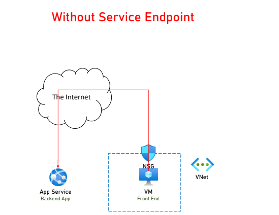

# Virtual Networks
A network in which you can deploy cloud resources.
VNets cannot communicate with each other by default. 

* Scoped to a single Region
* Scoped to a single Subscription 
* Can be connected via Peering
* Segmented using Subnets
* Protected using NSG(on Subnets)
# CIDR notation

# Subnets
A logical segment in the VNet.
* Shares a subset of the Vnet's range.
* Is a must. Resources must be placed in a Subnet.
* Resources in a subnets can talk to resources in other subnets in the same VNet.
# Network Security Group
A gatekeeper for Subnets.  
* Defines who can connect in and out of subnets.
* A mini-firewall
* Some resources comes with NSG(VMs, etc.)

# Network Peering
> Sometimes, for security reasons, we want to put some resources in completely different VNets.

Main Reason:  
* Not to place non-public resources in a VNet that has a public access.  

> The database has possibility of security breach.

> Peering allows two VNets to connect to each other.

* From user's point of view it's a single VNet.
* Make sure address spaces are not overlapped.
* Can work across Region.

# Service Endpoint
> The larger the attack surface - the greater the risk.  
> Minimize it (public IPs) as much as possible.

Senario:  
A lot of managed services expose public IP.   
Sometimes these resources are accessed only from resources in the cloud.  

 
 Service Endpoint solve this security risk.  
 * Create a route from the VNet to the managed service
 * The traffic never leaves Azure backbone.
 * Access from internet can be blocked.

# Private Link
A newer solution compared to Service Endpoint.
* Can be used from on-prem networks.

# App Service VNet Integration
Allow access from App Service to resources within VNet.

# Load Balancer
Azure service that distributes load and checks healths of VMs.

* Work with cloud services or VMs or Scale Set.
* Public or private
* Operate at layer 5 of OSI
* Can't handle HTTP

## When to Use Load Balancer?
* Great for internal resources.
* Do not use for external resources.

# Application Gateway
Web traffic load balancer.  

* URL base routing.
* Similar to load balancer. 
* SSL Termination
* Header & URL rewrite.
* Operates at layer 7 of the OSI model.

