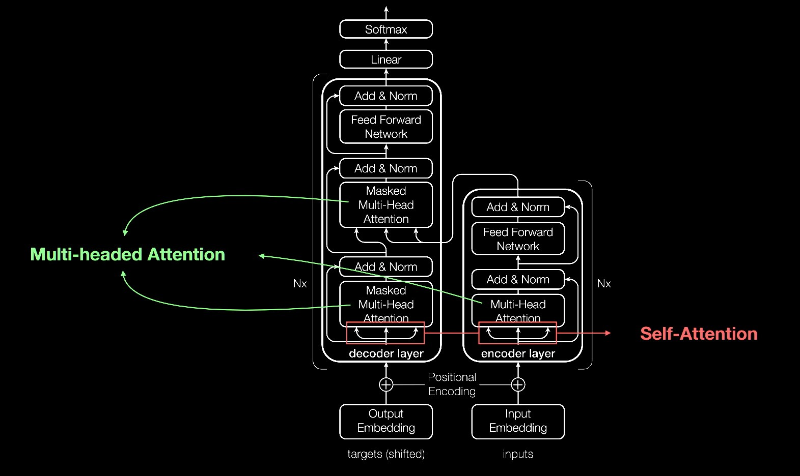

# Integration with Generative AI
## Description
This article will introduce technologies and researches about the integration of Generative AI.  
The following topics will be presented.  
1. Road map of Generative AI 
2. Application-level development of GAI
3. How GAI could be used in modern workflow
4. Difficulties and challenges
5. Example of local deployment of Llama2

## Road map of Generative AI 
### The rise of transformers  

> Attention Is All You Need.   

The **Transformer model** is a neural network architecture that was introduced in 2017 and has since become a popular choice for natural language processing (NLP) tasks. It is designed to **process and understand** language by listening to multiple pieces of information simultaneously, focusing on important parts, and combining them to get a complete understanding of the context. 

The Transformer architecture consists of a series of **residual blocks** that process the input data. Each residual block contains a **self-attention mechanism** that allows the model to focus on different parts of the input data at different times. It also uses a technique called "positional encoding" to help the model understand the order of the input data. 

